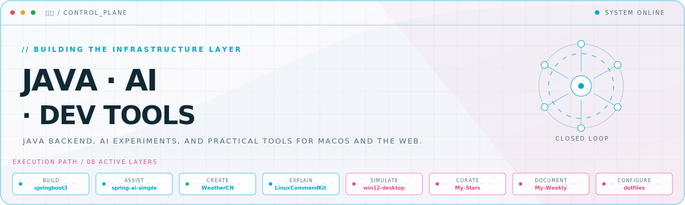
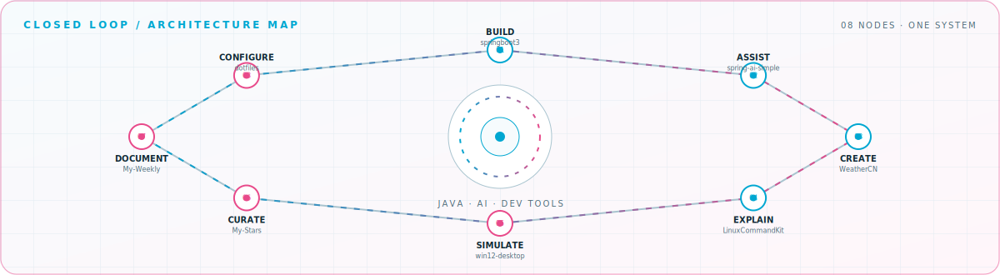

<picture>
  <source media="(prefers-color-scheme: dark)" srcset="assets/hero-dark.svg">
  <source media="(prefers-color-scheme: light)" srcset="assets/hero-light.svg">
  
</picture>

 

Java backend, AI experiments, and practical tools for macOS and the web\.

## Flagship systems

| Repository | Role | Purpose |
| --- | --- | --- |
| [`spring-ai-simple`](https://github.com/xiaozhouzhoua/spring-ai-simple)  | ASSIST | Multi-turn chat, persistent history, and structured output with Spring AI and Claude\. |
| [`WeatherCN`](https://github.com/xiaozhouzhoua/WeatherCN)  | CREATE | A native SwiftUI weather app for Chinese cities with search and favorites\. |
| [`LinuxCommandKit`](https://github.com/xiaozhouzhoua/LinuxCommandKit)  | EXPLAIN | A native macOS explorer for Linux commands, parameters, and practical examples\. |
| [`win12-desktop`](https://github.com/xiaozhouzhoua/win12-desktop)  | SIMULATE | A draggable Windows-style web desktop with terminal and file explorer experiences\. |
| [`My-Weekly`](https://github.com/xiaozhouzhoua/My-Weekly)  | DOCUMENT | A Chinese technical knowledge base for development practice and troubleshooting\. |
| [`My-Stars`](https://github.com/xiaozhouzhoua/My-Stars)  | CURATE | A categorized, automatically refreshed catalog of starred open-source projects\. |

## Closed-loop architecture

<picture>
  <source media="(prefers-color-scheme: dark)" srcset="assets/closed-loop-dark.svg">
  <source media="(prefers-color-scheme: light)" srcset="assets/closed-loop-light.svg">
  
</picture>

## Module registry

<strong>Java &amp; AI</strong> · 4 modules

| Module | Purpose |
| --- | --- |
| [`spring-ai-simple`](https://github.com/xiaozhouzhoua/spring-ai-simple) | Spring AI chat application with persistent conversations\. |
| [`spring-ai-demo`](https://github.com/xiaozhouzhoua/spring-ai-demo) | Spring AI experiments and interface prototypes\. |
| [`HutoolAiDemo`](https://github.com/xiaozhouzhoua/HutoolAiDemo) | Java AI integration experiments\. |
| [`springboot3`](https://github.com/xiaozhouzhoua/springboot3) | Spring Boot 3 practice and backend experiments\. |

<strong>Native macOS</strong> · 2 modules

| Module | Purpose |
| --- | --- |
| [`WeatherCN`](https://github.com/xiaozhouzhoua/WeatherCN) | SwiftUI weather app for Chinese cities\. |
| [`LinuxCommandKit`](https://github.com/xiaozhouzhoua/LinuxCommandKit) | SwiftUI explorer for Linux commands\. |

<strong>Web experiments</strong> · 4 modules

| Module | Purpose |
| --- | --- |
| [`win12-desktop`](https://github.com/xiaozhouzhoua/win12-desktop) | Interactive desktop interface built for the web\. |
| [`history-lens`](https://github.com/xiaozhouzhoua/history-lens) | AI Studio application experiment\. |
| [`opentui-demo`](https://github.com/xiaozhouzhoua/opentui-demo) | TypeScript terminal UI experiment\. |
| [`xiaozhouzhoua.github.io`](https://github.com/xiaozhouzhoua/xiaozhouzhoua.github.io) | Personal homepage and web showcase\. |

<strong>Knowledge &amp; automation</strong> · 4 modules

| Module | Purpose |
| --- | --- |
| [`My-Weekly`](https://github.com/xiaozhouzhoua/My-Weekly) | Chinese technical knowledge base\. |
| [`My-Stars`](https://github.com/xiaozhouzhoua/My-Stars) | Automatically refreshed starred-project catalog\. |
| [`ShellScript`](https://github.com/xiaozhouzhoua/ShellScript) | Shell scripts and automation experiments\. |
| [`dotfiles`](https://github.com/xiaozhouzhoua/dotfiles) | Personal development environment configuration\. |

<a href="https://github.com/xiaozhouzhoua">GitHub</a> · <a href="https://xiaozhouzhoua.github.io/">Homepage</a> · <a href="https://tinymind.me/xiaozhouzhoua">Notes</a>

<!-- Generated by profile-control-plane. Edit profile.yaml, not this file. -->
